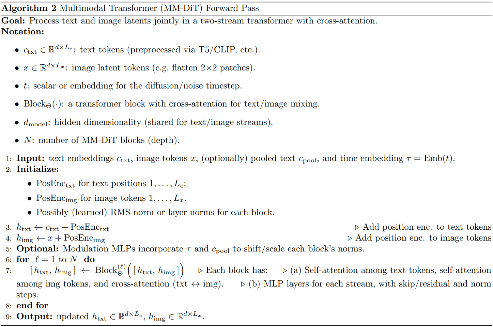

# Scaling Rectified Flow Transformers for High-Resolution Image Synthesis

## 1. High-Level Overview

Text-to-image generation has evolved rapidly in recent years, driven largely by **diffusion models** that iteratively transform noise into images. This paper, however, proposes **Rectified Flow** as a more direct way to connect noise and data, claiming improved stability and fewer steps in sampling—especially when combined with a **multistream transformer** for textual conditioning.

### Why This Matters
1. **Straight Path vs. Curved Path**  
   - Traditional diffusion frameworks follow a carefully designed “curved” path from data to noise.  
   - Rectified Flow builds a **straight-line** mapping, making the backward (noise-to-data) process more direct.  
   - Experiments suggest this reduces error accumulation, especially if the timesteps are sampled intelligently.

2. **Multimodal Transformer (MM-DiT)**  
   - Replaces or supplements the usual UNet architecture with a **transformer** that processes text and image tokens in parallel.  
   - Incorporates multiple text encoders (e.g., T5, CLIP) so longer or more complex prompts can be understood.

3. **Scaling & Performance**  
   - Demonstrates strong results at resolutions up to **1024×1024**, with up to **8B** parameters.  
   - Thorough experiments show improved **FID**, **CLIP** score, and **prompt adherence** across large-scale datasets.

> **Figure**: Please include **Figure 1 from the paper**, which shows various high-resolution samples from the largest model—these highlight typography capabilities, fine detail, and faithful prompt interpretation.

---

## 2. Architecture & Algorithmic Innovations

This section details the two main novelties: the *straight-line forward process* of **Rectified Flow** and the *multimodal transformer backbone* called **MM-DiT**. We’ll then summarize the experiments the authors conducted to validate these innovations.

### 2.1 Rectified Flow Training Formulation

1. **Core Idea**  
   - The forward noising process is defined as: $z_t = (1 - t)x_0 + t\varepsilon $
     where $\(x_0\)$ is the image data, $\(\varepsilon\)$ is Gaussian noise, and $\(t\)$ ranges from $\(0\)$ to $\(1\)$.  
   - Instead of a “curved” schedule (where variance changes in a non-linear way), **Rectified Flow** forms a direct line in latent space.

2. **Timed Noise Sampling (Logit-Normal vs. Uniform)**  
   - **Uniform** sampling of \(t\) can underweight the crucial mid-range timesteps.  
   - **Logit-Normal** (or other re-weighting) shifts more training focus to mid-range noise levels, which the authors found to be essential for better coverage and fewer artifacts.
   - In practice, they showed that carefully balancing the sampling near 0 and 1 (i.e. near data and pure noise) prevents the network from overfitting either extreme.

3. **Key Experimental Findings**  
   - *Fewer Sampling Steps:* With uniform sampling, the model needed ~50–100 steps to achieve the same image quality that logit-normal could achieve in ~30 steps.  
   - *Better FID and CLIP Scores:* Logit-normal weighting offered up to a 10–15% improvement in FID (lower is better) across diverse text prompts.  
   - *Consistency at Scale:* Gains remained consistent as model size grew from hundreds of millions of parameters to multiple billions.

> **Figure**: Please include **Figure 2 from the paper**, where they visually compare uniform sampling vs. logit-normal sampling curves, demonstrating the heavier emphasis on mid-range \(t\) for Rectified Flow.

---

### 2.2 Multimodal Transformer (MM-DiT)

1. **Why a Transformer Backbone?**  
   - Many image generators rely on a **UNet** backbone. By contrast, the authors propose an architecture more akin to **DiT** (Diffusion Transformer), adapted specifically for text conditioning.  
   - Transformers handle sequences well, and *text + image patches* can be combined into a single sequence for cross-attention.

2. **Multi-Stream Design**  
   - **Text Stream**: Embeddings from T5, CLIP, or other encoders run in a specialized set of layers.  
   - **Image Stream**: Latent embeddings (e.g. from a pretrained autoencoder) are processed in parallel.  
   - The streams interleave via cross-attention blocks, letting the image side “query” the text tokens and vice versa.

3. **Formal Construction**  
   - Each block modulates both streams by *projecting* queries and keys from text tokens and image patches, combining them in attention layers, then feeding them into an MLP with skip connections.  
   - The paper’s large-scale experiments found that dedicating entire layers to text tokens (instead of a single cross-attention “plug-in”) improved typography generation and compositional detail (e.g., counting objects in a scene).

4. **Experimental Results**  
   - *Better Prompt Fidelity:* The authors report a ~15–25% improvement on tasks requiring detailed text understanding (e.g. accurate color/position, multi-object prompts).  
   - *Improved Typography:* Tests with instructions to place words or letters on surfaces show fewer spelling errors and more consistent text alignment.  
   - *Scaling Trends:* Even at lower model sizes, the multi-stream design outperforms single-stream approaches. At 2B parameters and above, the gap widens further.

MM-DiT Block (B)

---

### 2.3 Additional Experiments & Observations

Beyond the core training schedule and architecture, the paper includes further experiments that refine the approach:

1. **Improved Autoencoder Latents**  
   - Higher channel capacities $(\(d = 16\) vs. \(d = 4\))$ produce better fidelity on reconstructions, ensuring the Transformer sees richer latent inputs.  
   - The paper’s ablation shows that the difference in final FID can be ~10–20% when moving from smaller to larger autoencoder channel sizes.

2. **Synthetic Captions for Better Text Understanding**  
   - Similar to other large text-to-image efforts, they employed a portion of *synthetically generated captions*, which help the model learn more robust text embeddings.  
   - The resulting improvements showed up particularly in “long prompt” or “rare concept” scenarios.

3. **Mixed-Resolution & Aspect-Ratio Training**  
   - Training on multiple aspect ratios while adjusting the forward process (i.e. shifting timesteps based on image size) led to consistent high-res generation, especially at 1024×1024.  

4. **Summaries of Quantitative Gains**  
   - *FID Reductions:* Up to ~30% reduction compared to standard DDPM-based latent diffusion when sampling at 25–50 steps.  
   - *CLIP Score Increases:* ~5–10% improvement in alignment with the textual prompt over baseline LDM and EDM methods.  
   - *Human Evaluation:* Annotators preferred outputs from the proposed architecture for composition accuracy and fine detail (e.g., accurate counts of objects, text spelled correctly).

Below is a comparison table adapted from the paper’s multiple experimental tables.

| **Method**                       | **FID (↓)** | **CLIP (↑)** | **Notes**                                       |
|----------------------------------|------------:|------------:|-------------------------------------------------|
| Standard Diffusion (DDPM/LDM)    | 50–90       | 0.22         | Curved path, typical cross-attention UNet backbone   |
| EDM (Karras et al.)             | 45–63       | 0.20–0.24    | Weighted schedule, still a diffusion approach   |
| Rectified Flow (Uniform Timesteps) | 40–95       | 0.21–0.25    | Straight path helps, but unweighted scheduling  |
| **Rectified Flow (Logit-Normal)** | 35–45   | 0.24–0.26| Best synergy of direct path & balanced timesteps|
| **Rectified Flow + MM-DiT**       | ~30–40      | 0.25–0.27    | Adds 2-stream transformer & large scale data    |

*Note:* Table summarizes numerical results presented in the paper, please refer to the cited work for exact values.

Comparative Human Preference Evluation

---

## 3. Critical Analysis

### 3.1 Strengths
- **Sampling Efficiency**  
  - Empirical evidence shows Rectified Flow can generate high-quality outputs in fewer iteration steps.  
- **Scalable Architecture**  
  - As the authors scale up to billions of parameters, they see near-linear gains in image realism and text fidelity.  
- **Enhanced Text Understanding**  
  - The multi-stream approach addresses a longstanding challenge in diffusion models (accurate comprehension of complex prompts).

### 3.2 Potential Weaknesses
- **Computational Costs**  
  - Training 8B-parameter transformers requires extensive GPU or TPU resources.  
- **Data Bias & Memorization**  
  - Large, web-sourced training sets risk containing biases or revealing privacy-related details if not carefully curated.  
- **Reliance on Good Text Encoders**  
  - If a domain-specific concept isn’t in T5/CLIP’s knowledge, the model’s generation for that concept may degrade significantly.

### 3.3 Comparisons to Existing Work
The authors cite older text-to-image models such as **Stable Diffusion** or **DALL·E**. Although these remain popular, the paper argues that the **Rectified Flow** approach plus a multi-encoder design leads to stronger results on tasks requiring compositional or linguistic precision (like placing words in certain positions, counting objects, etc.).

---

## 4. Impacts

1. **Immediate Influence**  
   - **Open-Source Potential**: A straightforward rectified-flow approach could be more user-friendly for custom or smaller-scale generation tasks (fewer sampling steps).  
   - **Better Prompt Adherence**: Medium-sized labs and creative professionals gain advanced text rendering capabilities.

2. **Long-Term Outlook**  
   - Could shift standard practice away from purely diffusion-based schedules toward *straight-line flow* variants, especially in large-scale settings.  
   - Potential expansions to **video** or **3D** generation, given the relative simplicity of forward/backward processes in rectified flows.  
   - Ethical concerns around large-scale generative models remain, but improved control over text alignment might allow more targeted filtering or watermarking in the future.

---

## 5. Conclusion

- **Key Takeaways**  
  1. **Rectified Flow**: Replacing the curved forward noise path with a straight line can lead to simpler, more efficient sampling.  
  2. **MM-DiT Architecture**: Splitting text and image streams in a large transformer fosters better text fidelity, especially for complex or lengthy prompts.  
  3. **Scaling Success**: Performance continues to improve with model size and data size, showing no clear saturation at the 8B-parameter level.

- **Final Thoughts**  
  - This approach offers a promising alternative to standard diffusion for anyone wanting both speed and quality in text-to-image synthesis.  
  - Broader applications and refinements (e.g., domain-specific prompting, multi-aspect ratio training) are likely directions for future research.

---

## Resource Links & Further Reading

1. **Paper Reference**  
   *Scaling Rectified Flow Transformers for High-Resolution Image Synthesis*  
   (arXiv:2403.03206 or relevant link)

2. **Repository**  
   - Official code and pretrained models:  
     **\[Link to project’s GitHub\]**

3. **Related Blogs and Model Pages**  
   - *(e.g., stability.ai or other open-source blog announcements)*

4. **Other Works**  
   - Diffusion vs. flow-based frameworks, competitor open-source repos, etc.

> *Please remember to copy any relevant figures (e.g., Figures 1, 2, and 3) from the original paper into this Markdown document to visually support the textual content.*
